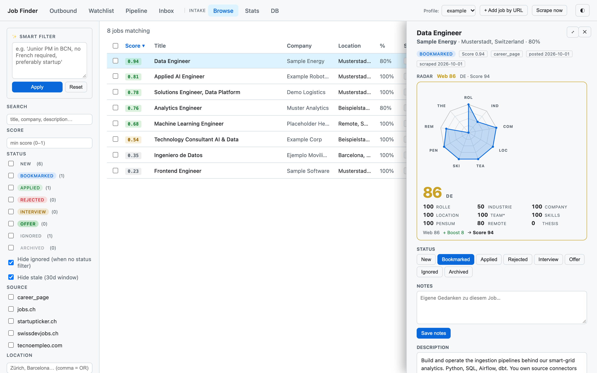
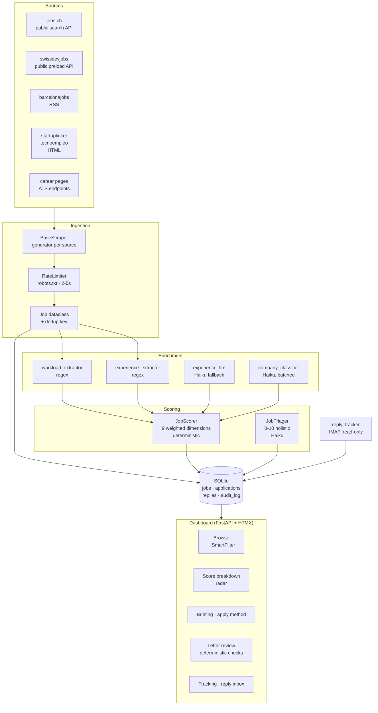
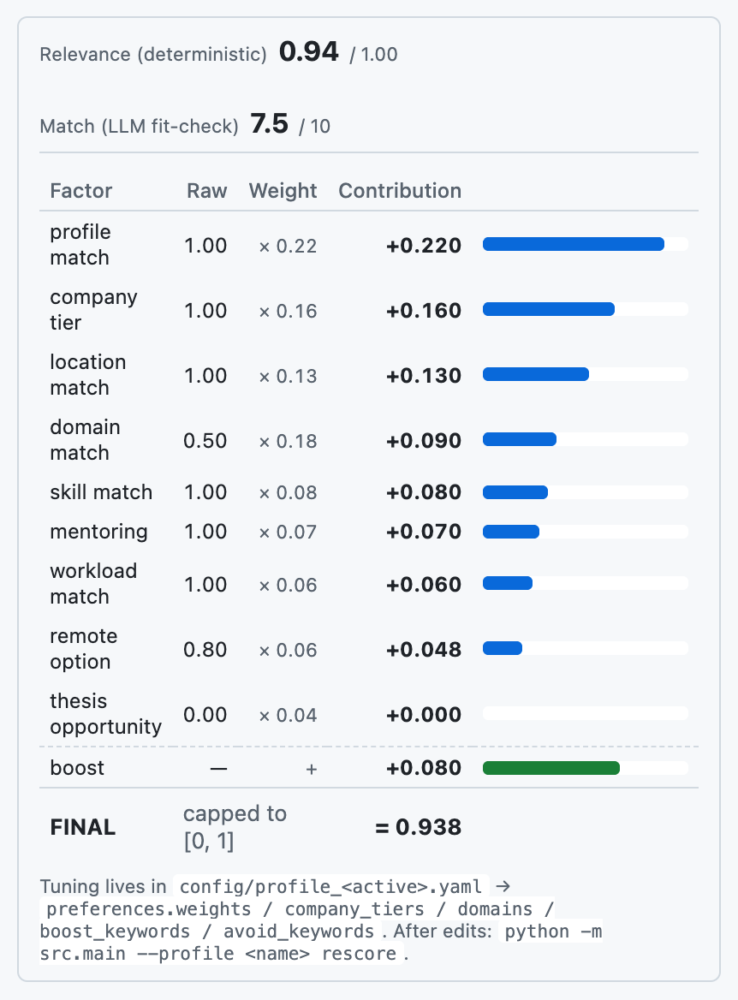
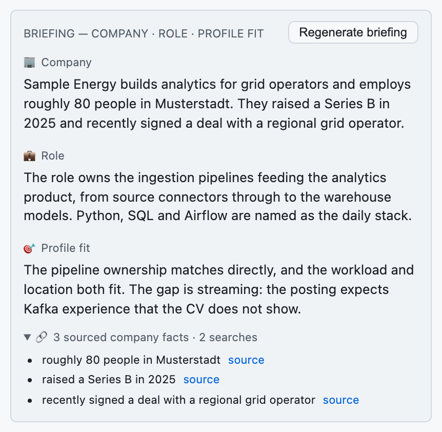
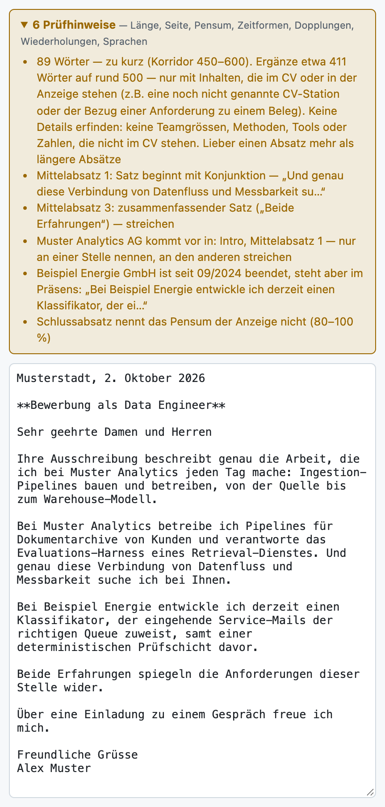

# Job Scoring Engine

[](https://github.com/thilo-h/job-scoring-engine/actions/workflows/ci.yml)

Scores job postings against a profile, twice and on purpose: once with a
deterministic, reproducible rule engine, and once with an LLM that judges what
rules cannot. Everything downstream — browsing, triage, letter review — exists
to make a human's decision better, not to replace it.

Python 3.12 · FastAPI · SQLite · HTMX · Anthropic API

> **What it does not do.** It does not write applications, does not send
> anything, and does not fill in forms. The one path that sends mail sends
> watchlist alerts to the operator's own address, and defaults to writing a
> file instead. Letter support is review only: the applicant writes the text,
> the tooling checks it against explicit rules.



*Mock mode on invented postings ([`scripts/seed_demo.py`](scripts/seed_demo.py)).
The list is ranked by the deterministic score; the drawer shows where one
posting's score comes from — nine dimensions on the radar, and the bridge from
the weighted web (86) plus boost (8) to the 94 in the list.*

### Start here

Four files carry most of what is interesting, if you only have a few minutes:

| File | Why |
|---|---|
| [`src/scoring.py`](src/scoring.py) | The deterministic half. Nine weighted dimensions, and a `score_breakdown()` that reconstructs the headline number from its parts so the UI cannot lie about its own arithmetic. |
| [`src/agent/briefing.py`](src/agent/briefing.py) | Citations as a schema obligation, then a deterministic check that feeds its objections back to the model as a `tool_result` until every company claim is sourced or gone. |
| [`src/agent/letter_quality.py`](src/agent/letter_quality.py) | 500 lines of letter rules with no model in sight, numbered against [the style guide](assets/example/letter_style_guide.md) they implement. |
| [`src/llm.py`](src/llm.py) | One client factory, and the offline mock that lets the whole application — and 335 tests — run with no API key and no network. |

```bash
git clone … && pip install -e ".[dev]" && pytest     # 335 tests, no key needed
ANTHROPIC_MOCK=1 uvicorn dashboard.app:app           # the real UI, canned model replies
```

---

## Contents

- [Architecture](#architecture)
- [Scoring](#scoring)
- [Prompt architecture](#prompt-architecture) — schemas, caching, batching, the repair loop
- [Data sources](#data-sources)
- [Getting started](#getting-started)
- [Project layout](#project-layout)
- [Tests](#tests)
- [Design decisions](#design-decisions)
- [Limitations](#limitations)

---

## Architecture



Two things are worth pointing out in that picture. The deterministic scorer and
the LLM triager write to the same rows but never to the same column: a score
you can reproduce from the config stays separable from a judgement you cannot.
And every enrichment step degrades to `NULL` rather than to a guess — an
unknown workload is stored as unknown, not as a default.

---

## Scoring

### Deterministic

`src/scoring.py` produces a 0–1 score from nine weighted dimensions, all
configured per profile in YAML. The weights below are the example profile's:

| Dimension | Weight | Signal |
|---|---|---|
| `profile_match` | 0.22 | role family, first match in an ordered list wins |
| `domain_match` | 0.18 | target industry; title and company name count fully, description-only hits at 0.75 |
| `company_tier` | 0.16 | tier 1/2/3 target-company list |
| `location_match` | 0.13 | primary location > secondary > country > elsewhere |
| `skill_match` | 0.08 | overlap with CV skills plus configured method keywords |
| `mentoring` | 0.07 | career development mentioned in the posting |
| `workload_match` | 0.06 | distance from the preferred percentage |
| `remote_option` | 0.06 | remote or hybrid mentioned |
| `thesis_opportunity` | 0.04 | thesis option mentioned |

On top of the weighted web sit boosts (a language the profile actually has, and
entry-level markers) and penalties (seniority keywords, and a structured
penalty derived from `min_years_experience`). `score_breakdown()` returns every
raw sub-score plus a bridge that reconciles the web with the final number:

```
Web 75 + boost 15 − penalty 5 → score 85
```

The bridge exists because boosts and penalties sit outside the radar. Without
it the big number would not match the area beneath it, and a reviewer could not
tell why.



*"Why this score?" in the dashboard: every factor's raw value times its weight,
summed and capped, so the headline number can be checked line by line. The LLM's
7.5/10 sits above it, deliberately in a separate field.*

A few decisions in there are worth more than the formula:

- **Title beats description.** An industry keyword in the title or company name
  is a real signal. The same word buried in 4000 characters of description is
  usually boilerplate, so those hits are discounted rather than trusted.
- **No recognised domain means neutral, not bad.** Scoring an unrecognised
  industry at zero punishes every posting that happens not to use your
  vocabulary.
- **Absolute skill target, not a ratio.** Full marks at three matched skills.
  Scoring matches as a share of the CV's skill list produced a median of 0.00,
  because postings do not list the long tail of a CV.

### LLM triage

`src/agent/triage.py` scores the same posting 0–10 with a short reason plus
strengths and gaps. It is explicitly *not* the deterministic score: it is
holistic, it is not reproducible, and it is stored in its own column. Its job
is to catch what the rules cannot — a role that ticks every keyword and is
still wrong.

---

## Prompt architecture

The interesting part of this repo, and the reason the prompts are checked in
rather than hidden in strings.

### Structured output through tool schemas

Every model call that must return structured data declares a tool and requires
it, rather than asking for JSON and parsing hopefully. The payoff is sharpest
in `src/agent/smart_filter.py`, which turns "junior PM in Barcelona, no French,
preferably a startup" into query parameters: the schema enumerates every valid
sort column, status, source and experience band, so the model *cannot* invent a
filter key that does not exist. The schema is the validation.

### Prompt caching

System blocks are ordered stable-to-variable and marked for caching, so the
expensive, unchanging context is paid for once:

| Module | Model | Cached system blocks |
|---|---|---|
| `triage.py` | Haiku 4.5 | rules prompt, CV |
| `briefing.py` | Haiku 4.5 | briefing rules, CV |
| `experience_llm.py` | Haiku 4.5 | extraction rules |
| `apply_method.py` | Haiku 4.5 | channel/document taxonomy |
| `smart_filter.py` | Sonnet 5 | filter grammar, profile background |
| `chat.py` | Sonnet 5 | mode prompt, job context |

A test asserts that job-specific text never lands in a cached block. Without
that, the prefix would change on every posting and the cache would never be
read — the failure mode is silent, and only visible as a bill.

### Batching

`company_classifier.py` classifies companies 20 per call and caches the result
per company in `company_profiles`, so each company is paid for once ever, not
once per posting. With thousands of postings across a few hundred companies,
that is the difference between a few cents and a few dollars.

### Model choice per task

Haiku 4.5 for classification and extraction, Sonnet 5 for the two paths where
language quality or tool orchestration matters. The per-call cost constants live
next to each module's model id, so the cost of a feature is visible where the
feature is written, and a test keeps them consistent with the pinned model.

Three constraints travel with the model choice, all of them silent when wrong:
`max_tokens` covers thinking as well as the answer, so the Sonnet callers state
their thinking mode and budget for it; `effort` is set per route, `low` for the
latency-sensitive filter; and the newer `web_search` variant is only available
on the Sonnet tier, so the Haiku caller keeps the basic one. See
`docs/llm-usage.md`.

### Graceful degradation

`experience_llm.py` is the clearest case: asked for a number of years, it
returns `None` when the posting gives no reliable signal. "I cannot tell" is a
first-class answer, stored as `NULL`, and the UI treats it as unknown rather
than as zero. The regex extractor runs first and handles the explicit phrasings
for nothing; the model is asked only about the rest, which on the corpus this was
tuned against was most of them. Regex before model, not instead of it.

`triage.py` also parses defensively: some outputs ignore an array schema and
return `<item>a</item><item>b</item>` in a single string. That is normalised
back into a list in three places rather than trusted once.

### Citations as a schema obligation

A model asked about a company produces fluent, plausible, unsourced claims. The
briefing's tool schema therefore does not accept a company summary on its own:
every company fact used in it must arrive in `company_facts` with the
`source_url` of the search result it came from, and both fields are `required`.
Sourcing is not a request in the prompt that the model can drift away from — it
is a field it cannot omit.



*A briefing as the dashboard shows it. Each company claim in the summary is
listed underneath with the search result it came from. In this picture the
model's answer is a hand-written mock fixture, so it shows the shape, not the
quality.*

### Deterministic validation as a repair loop

A required field is only half a guard: the model can still cite a URL it never
saw. So `briefing.py` collects the URLs the search tool actually returned and
checks every citation against that set. A mismatch is a finding, and findings go
back to the model as a `tool_result` saying the submission was **not accepted**,
with the objection attached. The model revises, the check runs again, bounded by
`MAX_REPAIR_ROUNDS`.

```
research → submit → deterministic check ─ findings ─→ tool_result + objection
                          │                                      │
                       no findings                          revise, resubmit
                          ↓                                      │
                        accept  ←───────────────────────────────┘  (max 2 rounds)
```

Three properties make this worth the round trip. The rule lives in code, so it is
reproducible and costs nothing to run. The model does the rewriting, which is the
part a rule cannot do. And what survives is either sourced or gone — with
anything unresolved surfaced in the UI rather than quietly kept, because a guard
that hides its own failures is decoration.

The shape generalises to any case where a deterministic rule can judge a model's
output. `letter_quality.py` is the same idea without the loop: rules in code,
findings to a human.



*Letter review on a deliberately flawed draft. No model is involved: the rules
report in German, and they know the CV — the fifth finding catches a job that
ended in 09/2024 written about in the present tense.*

### Agentic tool use

`apply_method.py` combines a tool schema with the server-side `web_search`
tool: it determines how to apply for a posting — channel, address, required
documents — and searches for the careers page when the posting does not say. It
reports; it does not act.

---

## Data sources

| Source | Method | Note |
|---|---|---|
| jobs.ch | public search API | undocumented but unauthenticated; retry with backoff |
| swissdevjobs.ch | public preload API | one request returns every posting |
| barcelonajobs.com | RSS feed | published for machine consumption |
| startupticker.ch | server-rendered HTML | degrades to 0 results instead of crashing |
| tecnoempleo.com | server-rendered HTML | paginated, rate-limited |
| company career pages | ATS endpoints | Greenhouse, Lever, Personio, Teamtailor, Ashby, SmartRecruiters |

### On terms of use

Portals whose terms prohibit automated access — LinkedIn, Indeed, Glassdoor —
are **not implemented**, and a test asserts that no scraper and no source enum
points at them. Where a source offers an RSS feed, a public API or an ATS
endpoint, that is used in preference to parsing HTML.

Three obligations are enforced in `src/scraper/rate_limiter.py`, and enforced
*structurally* rather than by convention:

- **Identification.** Every request carries `JobScoringEngine/0.1`. Not a
  browser string — that is the point. A site that wants to refuse this tool has to be able to recognise it,
  and a `robots.txt` rule only means something if the name you evaluate it under
  is the name you send. Set `scrapers.rate_limiting.user_agent` in the profile to
  add a contact address, which is worth doing for anything unattended.
- **robots.txt.** Checked per host, cached, evaluated under that same
  User-Agent. A disallowed path raises `RobotsDisallowed`, which subclasses
  `requests.RequestException`, so it travels the error path every scraper already
  has: logged and skipped, never a crashed run.
- **Rate limiting.** A randomised 2–5 second delay between requests, configured
  per profile.

The enforcement lives in `PoliteSession`, a `requests.Session` subclass that
checks before it fetches. Each scraper uses it instead of a raw session, so a
new scraper inherits all three and bypassing them is not an available mistake.

> **This was not always true, and the honest version is the reason it says so
> here.** In an earlier state the `robots.txt` machinery existed and was called
> by nobody, and every scraper sent a Chrome User-Agent while the README claimed
> otherwise. A compliance claim that nobody verifies is worse than no claim, so
> the behaviour now has tests: that the User-Agent impersonates no browser, that
> no module carries its own, that every scraper fetches through `PoliteSession`,
> that a disallowed URL is refused, and that the rules are evaluated under the
> User-Agent actually sent.

**What this does not settle.** Respecting `robots.txt` and identifying yourself
is etiquette and evidence of good faith; it is not a legal opinion about any
particular site's terms. Before pointing this at a source, read that source's
terms yourself. The database it builds is not in this repo and should not be
published: job postings can contain named contact persons, which makes a
scraped corpus personal data under GDPR and the Swiss DSG.

---

## Getting started

```bash
git clone https://github.com/thilo-h/job-scoring-engine.git
cd job-scoring-engine
python3 -m venv .venv && source .venv/bin/activate
pip install -e ".[dev]"
cp .env.example .env          # only ANTHROPIC_API_KEY is needed for the LLM parts
```

The repo ships a complete fictional profile, so everything runs without your
own data:

```bash
python -m src.main --profile example scrape     # populates data/jobs_example.db
python -m src.main --profile example top -n 20  # ranked, with score breakdown
```

Dashboard:

```bash
uvicorn dashboard.app:app --reload
```

Scraping, deterministic scoring, the dashboard and the letter checks need no
API key at all. The LLM features (triage, briefing, smart filter, chat,
classification) need `ANTHROPIC_API_KEY` — **or** mock mode, which runs them
against canned responses so the whole application is explorable with no key and
no network:

```bash
ANTHROPIC_MOCK=1 python -m src.main --profile example classify-companies
ANTHROPIC_MOCK=1 uvicorn dashboard.app:app
```

To look around without scraping anything, `python scripts/seed_demo.py` fills
`data/jobs_example.db` with nine invented postings, runs triage and a briefing on
one of them through the dashboard's own routes in mock mode, and saves a flawed
draft for the letter review. The screenshots in this README come from that
database.

The canned responses live in `fixtures/llm/`, one file per tool, and each says
in its own `_comment` that it is hand-written rather than recorded. They are
shaped like real responses — tool-use blocks, usage counters, server-tool
blocks — so the parsing, the schema handling and the cost arithmetic are
genuinely exercised. They say nothing about how well the model answers.

To use your own data, copy `config/profile_example.yaml` to
`config/profile_<name>.yaml`, put your CV markdown under `assets/private/`
(gitignored) and point `assets.cv_md` at it.

---

## Project layout

```
src/
  scoring.py              deterministic scorer, 9 dimensions
  radar.py                the same sub-scores as an SVG nonagon
  models.py               Job dataclass, enums, dedup key
  database.py             schema, idempotent migrations, queries
  config.py               profile resolution and validation
  llm.py                  client factory + offline mock for tests and demos
  watchlist.py            second search path: observe, do not filter
  experience_extractor.py regex: required years of experience
  workload_extractor.py   regex: workload percentage
  digest.py  notify.py  mailer.py   self-notifications only
  scraper/
    base.py               abstract scraper, generator interface
    rate_limiter.py       robots.txt + throttling
    …                     one module per source
  agent/
    triage.py             holistic 0-10 fit judgement
    smart_filter.py       natural language → query parameters
    company_classifier.py startup/scaleup/SME/enterprise, batched
    experience_llm.py     LLM fallback for the regex extractor
    briefing.py           company / role / fit summaries
    apply_method.py       how to apply, which documents
    url_extractor.py      pasted URL → structured posting
    chat.py               interview prep · application advice · letter review
    letter_quality.py     deterministic letter rules, no model
    letter_review.py      markdown ⇄ structure, runs the rules
    docx_generator.py     A4 layout, typography, page-fit measurement
    reply_tracker.py      IMAP, read-only: correlate and classify replies
dashboard/                FastAPI + HTMX, one router per area
assets/example/           fictional CV and letter style guide
config/                   profile and watchlist YAML
fixtures/llm/             canned model responses, one file per tool
tests/                    offline test suite; conftest blocks the network
scripts/                  maintenance jobs; seed_demo.py fills a demo database
docs/                     architecture walkthrough, LLM cost table, SQL recipes
```

---

## Tests

```bash
pip install -e ".[dev]"
pytest                          # 335 tests, no API key, no network
pytest --cov=src                # coverage report
```

Every test runs offline. `conftest.py` blocks socket connections outright, so a
test that reaches for the network fails rather than passing on one machine and
failing on another, and mock mode is the default for every test. The same two
commands run in CI ([`.github/workflows/ci.yml`](.github/workflows/ci.yml)) with
no API key in the environment, which is the point: if the suite needed one, it
would not be able to pass there.

Where the coverage sits, and why:

| Area | Coverage | What the tests pin |
|---|---|---|
| `models.py`, `briefing.py` | 100% | dedup identity; the citation check and its repair loop end to end |
| `experience_extractor.py` | 98% | the hits, and every deliberate miss |
| `smart_filter.py` | 97% | that the schema enumerates only real values |
| `apply_method.py` | 96% | tool use alongside a server tool |
| `llm.py` | 93% | the mock itself, and the missing-key error |
| `letter_review.py` | 91% | markdown ⇄ structure round-trip, including CRLF input |
| `scoring.py`, `letter_quality.py` | 88% | ordering and per-dimension behaviour; each numbered style rule |
| `chat.py`, `triage.py` | 82–85% | mode separation; the XML-in-array repair |
| `database.py` | 62% | fresh schema, both migration directions, dedup, retention |
| `reply_tracker.py` | 56% | header decoding, both correlation strategies, the confidence floor |
| scrapers | 30–76% | parsing against local fixtures — the fetch loops need a network |
| `main.py` (CLI) | 13% | first-run behaviour only |

The suite is deliberate about two things.

**It asserts on requests, not only on responses.** That the system blocks are
marked for caching. That job-specific text stays *out* of them, so the cached
prefix survives from posting to posting — get that wrong and nothing breaks,
the bill just goes up. That the filter schema enumerates only values the database
has. That 23 companies become 2 API calls rather than 23. That no sampling
parameter is sent to a model that rejects them, and that the `web_search` variant
matches the model tier, which is a 400 only in the branch that actually searches.

**It covers the failure paths, not just the happy ones.** An invented citation
triggers a repair round and the claim disappears. A model that never fixes it
hits the round limit and the objection reaches the UI instead of being swallowed.
A model that returns prose instead of a tool call raises rather than returning
three empty strings. Each regex extractor has as many negative cases as positive
ones, because a false "10 years required" is what quietly buries the right jobs.

What no test here shows is whether the model *answers well*. That needs a
labelled set and an eval harness — see [Limitations](#limitations).

---

## Design decisions

**SQLite, not Postgres.** One operator, one machine, a few thousand rows.
SQLite's `.backup` gives a consistent copy of a live database, which is the
only durability property that matters here.

**HTMX, not a SPA.** The UI is tables, forms and a drawer. Server-rendered
partials swapped over the wire keep the whole thing in Jinja templates with no
build step and no client state to desynchronise.

**Generator pattern in the scrapers.** `scrape()` yields `Job` objects instead
of returning a list, so a source with thousands of postings streams through
scoring and into the database at constant memory. A scraper that dies halfway
still logs what it found.

**Profiles as YAML, not code.** Weights, target companies, role families and
industry keywords are data. Retuning the scorer is a config edit and a
`rescore` run, with no deployment.

**Scoring is not in the model.** The deterministic score has to be explainable
and reproducible: the same posting and the same config must give the same
number a month later. The model's judgement is additive and lives in its own
column.

**The letter path checks, it does not write.** `letter_quality.py` implements
the rules from `assets/example/letter_style_guide.md` without a model call, so
the same findings appear whether the text was generated, typed or pasted. The
section numbers are the contract between the guide and the code.

---

## Limitations

Honest list, because the gaps say as much as the features.

- **No evaluation harness.** This is the real gap, and it is not the same thing
  as the test suite. The tests prove the machinery works; nothing here measures
  whether the *rankings are any good*. The scoring weights are hand-tuned
  against intuition and spot checks, not against a labelled set, and there is no
  measurement of precision, recall or rank correlation with a ground truth.
  Retuning is therefore guesswork validated by eyeball. A labelled set of a few
  dozen postings and a scripted eval run would change that, and it is the next
  thing worth building.
- **The canned LLM responses are invented, not recorded.** They exercise the
  parsing faithfully and the cost arithmetic exactly, and they say nothing about
  model quality. Recording real responses would make the fixtures a weak
  regression signal for prompt changes; it would still not be an eval.
- **Uneven test coverage.** The parts worth testing offline are covered well.
  The scrapers' fetch loops, the CLI wiring and much of the query layer are not.
- **The extractors are regex, and regex has a tail.** They are deliberately
  conservative — `None` rather than a guess — and the negative cases are tested
  as carefully as the positive ones. Phrasings nobody has hit yet will still slip
  through, and the honest fix for the long tail is the LLM fallback that already
  exists for experience, not a longer pattern.
- **Scrapers are structurally fragile.** HTML sources break when a site is
  redesigned. They fail to zero results rather than crashing, but a silent zero
  is still a failure mode that only a human notices.
- **Single operator.** No multi-user auth beyond optional HTTP basic auth, no
  concurrent write handling beyond SQLite's own locking.
- **Page-fit measurement needs LibreOffice.** The letter checks that measure
  actual page overflow shell out to a headless LibreOffice. Without it, every
  other check still runs; only the page measurement is skipped.

---

## License

MIT — see [LICENSE](LICENSE).
